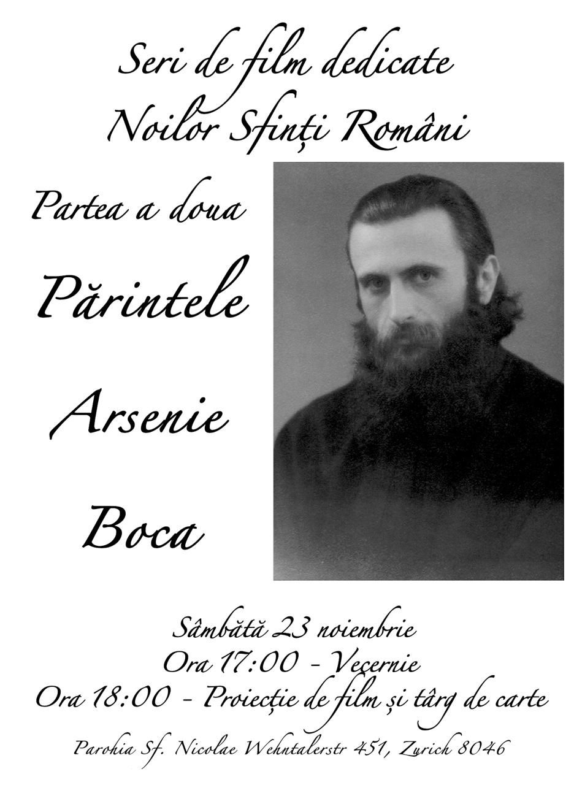

#### Seri de film dedicate noilor sfinți români

În urma deciziei Sfântului Sinod din 11-12 iulie 2024, de canonizare a noilor Sfinți români în anul 2025, parohia noastră din Zurich vă invită la o serie de filme dedicate acestor Sfinți. Anul 2025 a fost declarat la nivel național Anul Centenar al Patriarhiei Române, căci Biserica Ortodoxă Română va împlini 140 de ani de la recunoașterea Autocefaliei (aprilie 1885) și 100 de ani de la ridicarea sa la rangul de Patriarhie (februarie 1925).

A doua editie este dedicata parintelui Arsenie Boca.  

[https://ziarullumina.ro/actualitate-religioasa/comunicate-de-presa/noi-hotarari-ale-sfantului-sinod-al-bisericii-ortodoxe-romane-190991.html](https://ziarullumina.ro/actualitate-religioasa/comunicate-de-presa/noi-hotarari-ale-sfantului-sinod-al-bisericii-ortodoxe-romane-190991.html)

