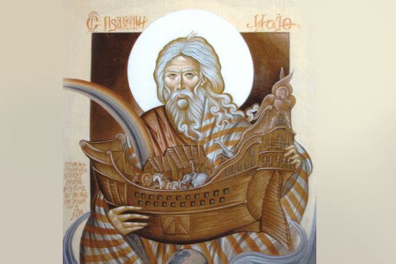
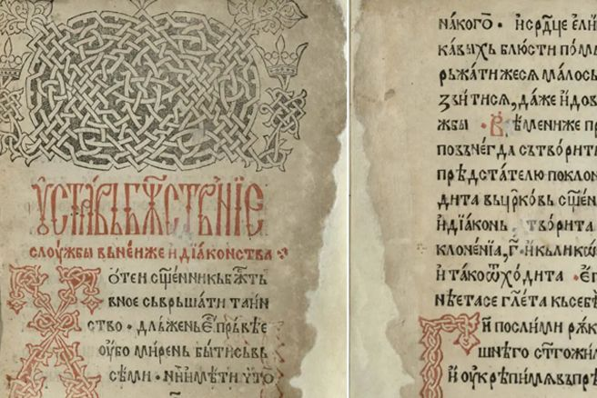
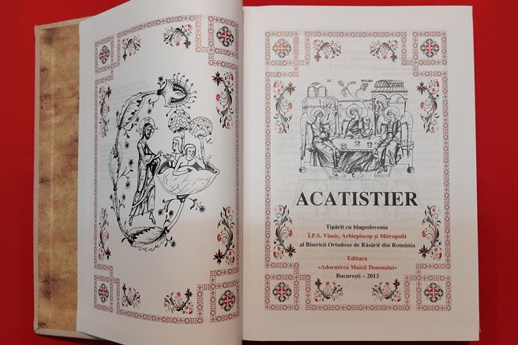
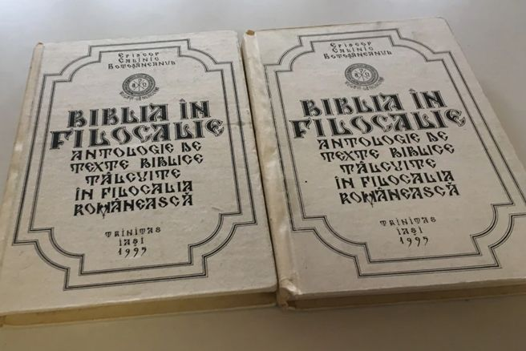

## Catehismul Bisericii Ortodoxe

Credinta crestina este invatatura lui Hristos despre cele mai insemnate taine ale fiintei si ale vietii, invatatura pe care oamenii o pot primi numai prin credinta in El, iar nu prin propriile stradanii.

[Citeste mai mult](https://www.crestinortodox.ro/carti-ortodoxe/catehismul-bisericii-ortodoxe/) 

## Liturghierul

_Liturghierul_ cuprinde slujba celor trei Sfinte Liturghii din cultul ortodox, alături de rânduiala Celor șapte Laude și alte slujbe și rânduieli din timpul anului bisericesc

[Citeste mai mult](http://www.liturghier.org/) 

## Acatistier

Acatistierul sau culegerea de acatiste a fost publicat in România pentru prima oara într-o ediție sinodală (cu aprobarea Sfântului Sinod al Bisericii Ortodoxe Române) in anul 1971. Edițiile sinodale ale Acatistierului sunt cărțile de rugaciuni folosite de către preoți și slujitori.

[Citeste mai mult](https://invataturiortodoxe.ro/carti-de-rugaciuni/acatistier.html) 

## Filocalie

Filocalia  (sau culegerea din scrierile Sfinților Părinți care ne arată cum se poate omul curăți, lumina și desăvârși) este o culegere sau antologie din scrierile pustnicilor, monahilor și clericilor ortodocși din secolele IV - XV, majoritatea centrate pe practicarea virtuților și a vieții spirituale din mănăstiri.

[Citeste mai mult](https://invataturiortodoxe.ro/ascetica/filocalia-vol-1-12.html)
