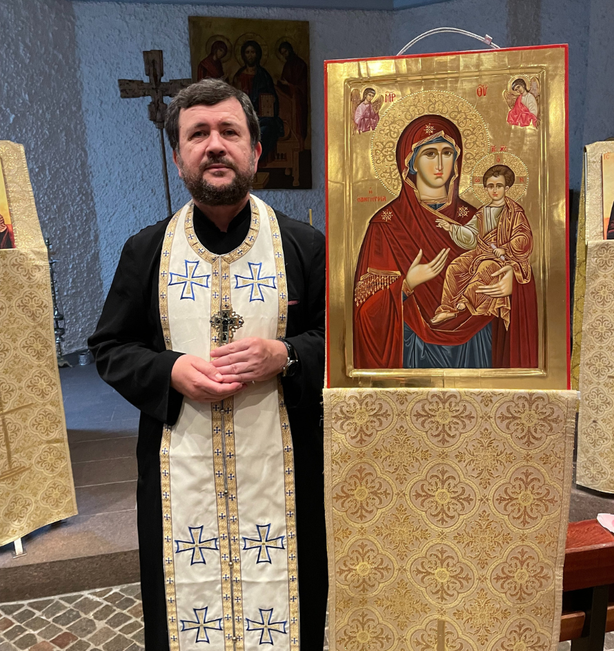
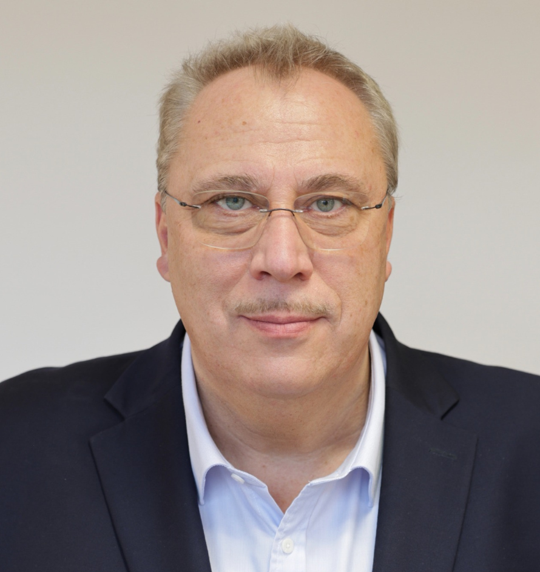
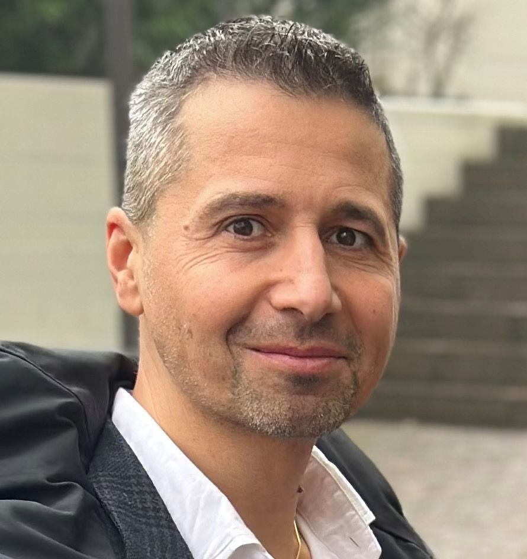
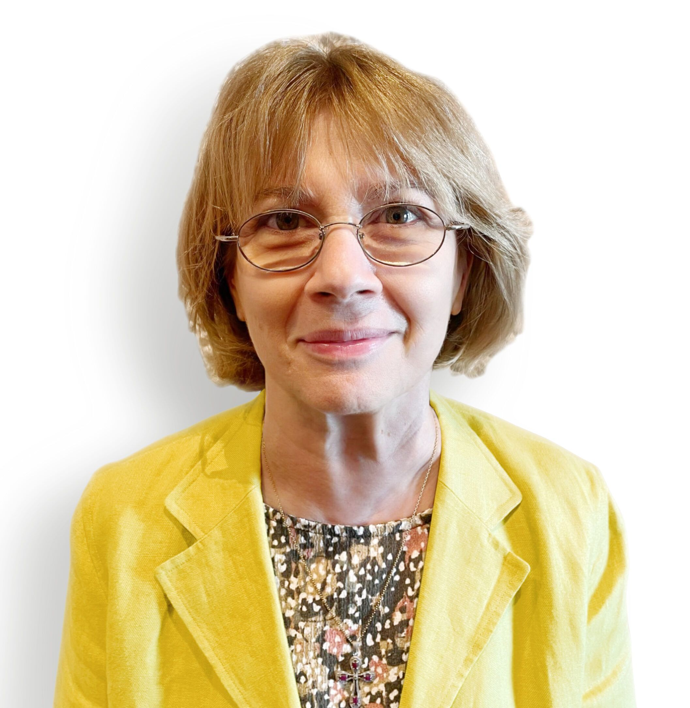
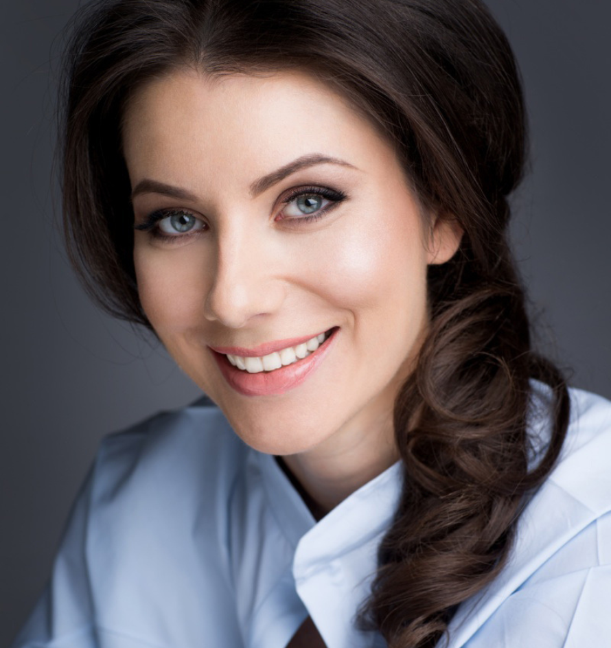
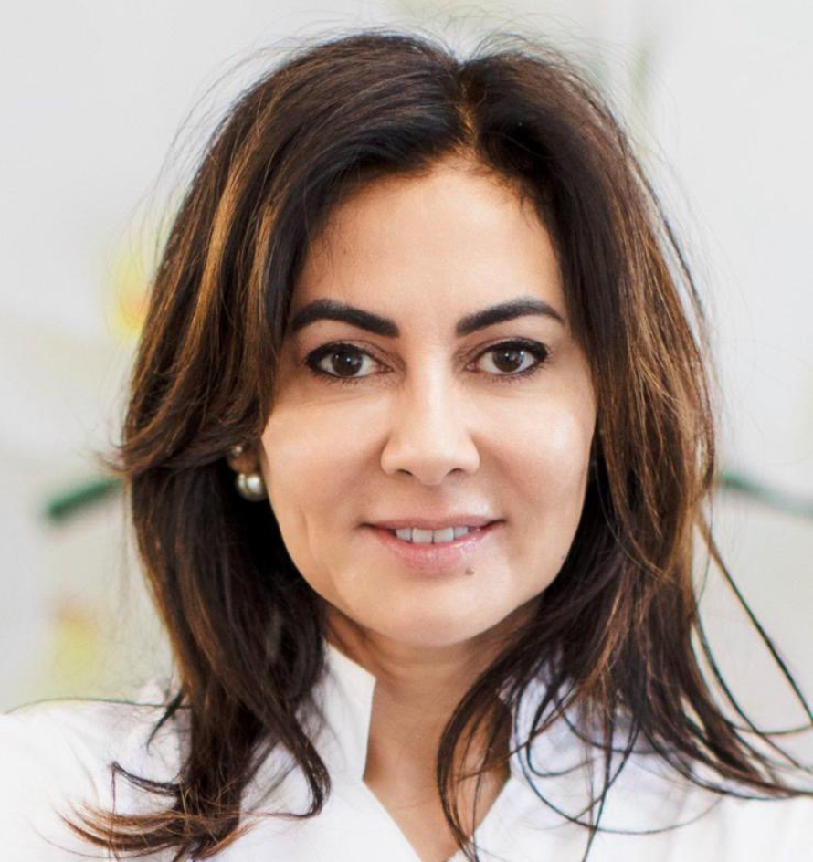

Consiliul Parohial este format din 7 membri alesi pe o perioada de 3 ani. In prezent, din Consiliul Parohial fac parte:

## Preot Paroh Romică-Nicolae Enoiu

## Dr. Razvan Popescu

## Iustin Rusu

## Manuela Schmidt

## Raluca Simu

## Dr. Simone Adela Sylver

## Eduard Gabriel Bazavan

