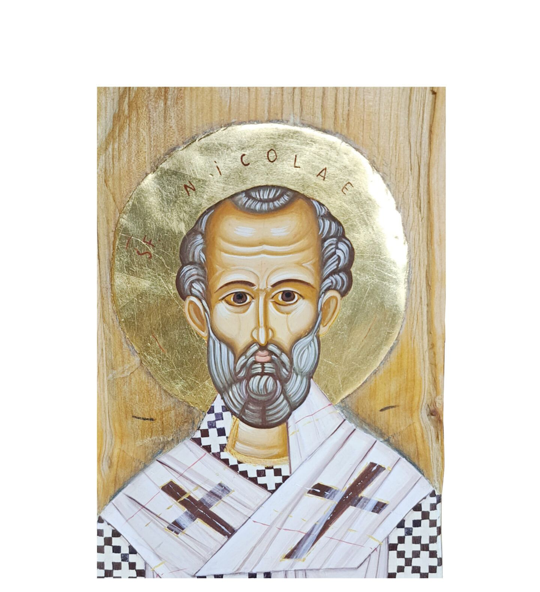
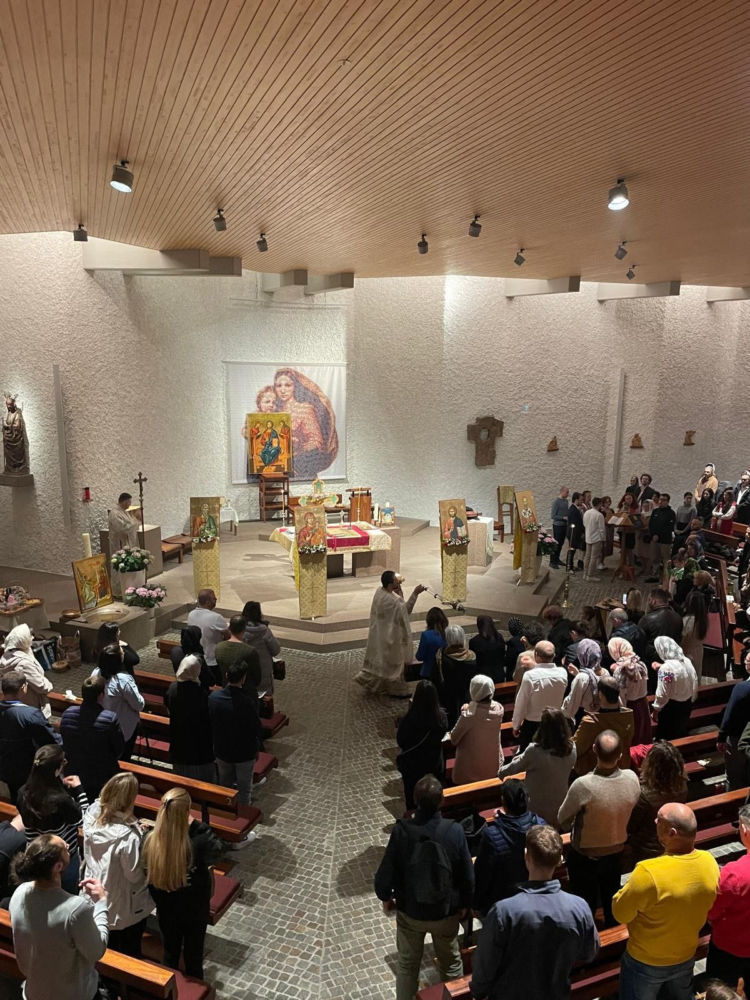

## Parohia Ortodoxa Romana Sfântul Nicolae din Zürich

Elveția, ca de altfel multe alte țări ale Europei Occidentale, a fost și este o a doua patrie pentru mulți români, ajunși fiecare pe aceste meleaguri din diferite rațiuni, pentru o scurtă sau mai lungă perioadă. Evident că atașamentul acestor confrați la valorile spirituale și culturale românești s-a manifestat și în acestă situație, ceea ce a determinat crearea unor parohii ortodoxe, în jurul cărora s-au grupat, pentru a da slavă lui Dumnezeu în graiul străbun.

Cu ani buni în urmă s-au constituit parohii românești la Geneva, apoi Lausanne, apoi Lugano, ramânând doar zona germanofonă a Elveției fără o astfel de parohie. Deși mai puțin numeroși decât în zona francofonă, românii din Zürich și împrejurimi, prin inițiativa unui grup restrâns (Aurel Buda, Mihaela Keller-Iezan, Mihai-Sorin Stupariu și Mihai-Leonard Bercea), s-au adresat Înalt Prea Sfintitului Iosif Pop, Mitropolitul Europei Occidentale si Meridionale, rugându-l să aprobe și să binecuvinteze înființarea unei parohii și în acest oraș elvețian. Această acțiune a fost dintru început călăuzită și sprijinită de Preotul Romică-Nicolae Enoiu, care studia la Fribourg. Răspunsul prompt și favorabil al ÎPS Iosif i-a determinat pe inițiatori să contacteze într-un timp scurt cât mai mulți români din acestă zonă și să organizeze săvârșirea primei slujbe.

Prin rânduiala lui Dumnezeu, la aproximativ șase saptămâni de la prima idee lansată în acest sens, pe data de _20 decembrie 2001 († Sf .Ignatie Teoforul)_, în prezența Prea Sfințitului Părinte Siluan, Episcopul Vicar al Mitropoliei, Părintele Romică Enoiu a săvârșit prima slujbă la Zürich, după care a urmat un program de colinde, în Capela ortodoxă sârbă "Sf.Parascheva" din _Zollikerstrasse 74_. S-a slujit în acestă Capelă până la sfârșitul lunii februarie 2002, timp în care s-a căutat un spațiu liturgic stabil. Începând din luna martie 2002 ne-am instalat în Kripta Parohiei catolice "St.Katharina" din Zürich (Wehntalerstrasse 451), dotându-ne cu obiectele liturgice necesare și săvârșind cu regularitate sfintele slujbe, după un program anunțat.

Prin decizia _nr.51/1.02.2002_ ÎPS Iosif recunoaște oficial înființarea Parohiei Ortodoxe Române "Sf.Nicolae" din Zürich, "având în vedere nevoile pastoral-misionare din Zürich și împrejurimi" și numește ca preot paroh pe Părintele Romică Enoiu.

Adunarea membrilor parohiei a ales în data de _21.04.2002_ primul Consiliu parohial, șase reprezentanți ai credincioșilor, care împreună cu preotul slujitor sunt mandatați să elaboreze un statut de organizare al parohiei și să se ocupe de administrarea acesteia.

Întrucât parohia trebuie să se autofinanțeze Consiliul parohial în ședinta sa din _18.05.2002_ a decis fixarea unei contribuții anuale pentru toți membrii, practică întâlnită și la celelalte confesiuni creștine din Elveția, astfel ca toate cheltuielile necesare să poată fi acoperite.

De la deschiderea oficială a parohiei numărul credincioșilor este permanent în creștere, mulți dintre ei venind de la distanțe destul de mari (St.Gallen, Luzern, Basel, Olten, Aarau, etc.), demonstrând râvna lor spre cele sfinte și atașamentul lor la Biserica strămoșească.

Membrii parohiei sunt de diferite vârste, însă predomină familiile tinere, ceea ce explică numărul însemnat al botezurilor săvârșite până în prezent.

Hramul parohiei - Sfântul Ierarh Nicolae-6 decembrie - împreună cu marile Praznice ale creștinătății constituie pentru românii din zona germanică a Elveției adevărate popasuri duhovnicești și ocazii binecuvântate de împreună petrecere prin agapele ce se organizează.

Fie ca Milostivul Dumnezeu să reverse pururea harul și darurile Sale cele bogate peste întreaga comunitate.

 
