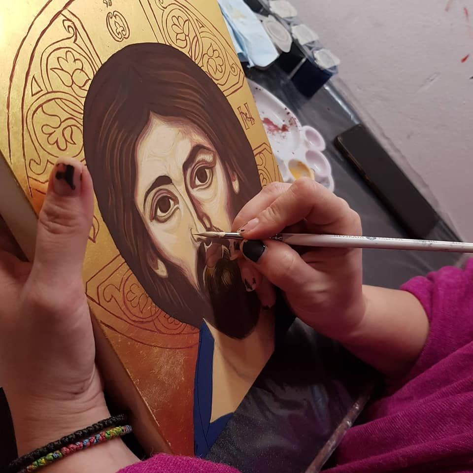
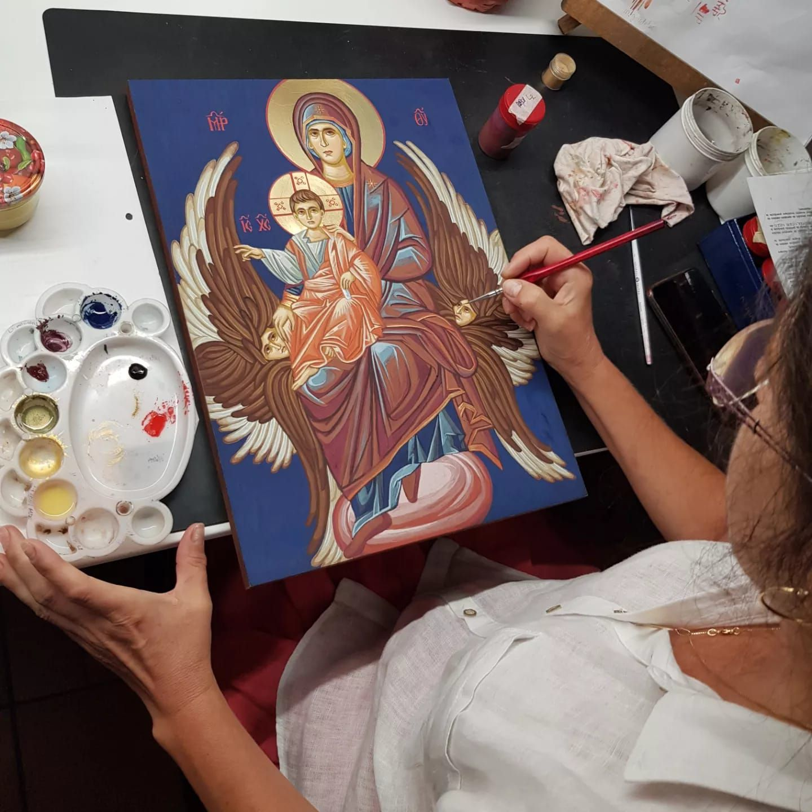

## Scopul școlii noastre

Să clădim o relație puternică și semnificativă între copiii vorbitori de limbă română, să-i ajutăm să pășească fără temeri si frustrări, cu o personalitate și identitate intărită, pe puntea dintre culturile în care trăiesc și le întălnesc in Europa Unită și Terra nețărmurită.

Limba și Literatura Română

Elemente de istorie și geografie

Educație civică, elemente de etică socială

Catehism ortodox

Audiții muzicale

Activități artistice cu prilejul sărbătorilor religioase

Desen, meșterit

## Programul școlii este orientat să ajute copiii:

Limba română

Să stăpânească elementele limbii române și să prețuiască valoarea acesteia in contextul bilingv sau multilingual al migrației Europene, folosindu-le cât mai frecvent

Socializare

Să se socializeze împreună cu copii de vârste apropiate, prin jocuri, conversație, cântec și dans

Cultură generală

Să pătrundă de mici tainele istoriei, culturii, geografiei, credinței tărâmului de unde le vin moșii si strămoșii

Credință

Să primească cuvântul Sf. Evanghelii și al Sfinților Părinți ai Bisericii Ortodoxe Române

## Pe cine poate ajuta școala noastră ?

-   Copiii dornici de joc, culoare, taine ale cuvintelor, deslușirea poveștilor, bucuria rostită a gândurilor în limba română.
-   Copiii interesați de tainele religiei creștine, de cunoașterea și trăirea tradițiilor românești in viața de zi cu zi, aici în diasporă, departe de patrie.
-   Părințiii din căsătorii mixte, preocupați de transmiterea valorilor culturale si spirituale românești urmașilor lor, in contextul migrației din diasporă.

## Cum ajută școala de duminică copilul bilingv?

Conștientizare

Orice limbă este un izvor nesecat; cu cât bem mai mult din el, cu atât mai spornic șuvoiește spre crinul inimii. Limba română, prin exercițiul trăit, nu va rămâne doar limba duminicilor copilăriei, ci va dăinui toată viața, întărind sufletele. Ingrijit la taina rugăciunilor și impreunaslujire, graiul românesc va dăinui, contribuind la dezvoltarea echilibrată a personalității copilului, la formarea unei identități stabile. Prin sacrificiul dragostei, răbdării și prin credința bunilor părinți, copilul va afla de mic avantajele exprimării in graiul mamei sau al tatălui si-l va prețui când va fi mare, ca pe o comoară.

Familiarizare

Conversația, scrisul, reflecțiile adhoc în școala noastră, vizează o armonizare și imbogățire a „trăistuței de vocabular“, adusă de copii, cu teme legate de folosirea altor limbi in contextul cotidian din Elveția (grădiniță, școală, vecini, multimedia etc.). La ore se discută diferențele si asemănările dintre expresiile românești cu cele din alte limbi, prin intermediul jocului. …și astfel se deschid adevărate colocvii de filozofie cu pruncii… Scriem și ce este la tablă, de ce se scrie așa, și ce se discută…. Cei mici colorează sau asistă mândri și „activi“ la străduințele celor mari.

Încurajare

Copiii sunt încurajați să participe activ la programul interactiv pregătit. Exprimarea orală este exersată prin joc, poezie si cântec, cu accent deosebit pe dicție/ scandare. Gândirea in limba româna este stimulată prin dezbateri legate de tema duminicii respective, de preocupările stringente ale copiilor. Autoreflecția și reflecția sunt exersate deopotrivă pe parcursul orelor, cu predilecție în timpul orelor de catehism. Credința este cea care Credința este cea care—-i i i i aduce pe copii la „Dimineața Duminicii“. „Arvuna Duhului“ primită la Sf. Botez (Corinteni 1, 22 și Romani 8, 23) lui“ primită la Sf. Botez (Corinteni 1, 22 și Romani 8, 23) lui“ primită la Sf. Botez (Corinteni 1, 22 și Romani 8, 23) lui“ primită la Sf. Botez (Corinteni 1, 22 și Romani 8, 23) lucrează. Căci „Împărăția lui Dumnezeu este înlăuntrul vostru“ (Luca 17, 21)

## Cine este implicat în buna organizare a școlii de duminică?

-   Înființarea școlii a avut loc în septembrie 2007 prin deosebita grijă a Părintelui Paroh R.N. Enoiu și a enoriașilor preocupați atât de păstrarea și transmiterea culturii românești, precum și de trăirea în credința creștină ortodoxă a tinerei generații.
-   Binecuvântarea I.P.S Mitropolit Iosif întărește străduințele școlii.
-   Slujirea diaconală, pe bazele eticii sociale ortodoxe, face parte integrantă din ansamblul activităților parohiale.
-   Părinții copiilor participă activ la buna desfășurare a activităților școlii.
-   Materialul didactic este pus la dispoziția necesităților școlii de Părintele Paroh, slujitorii școlii, și de unii dintre părinții copiilor (după posibilități).

## Va invăța copilul meu bine limba română? Fără accent? Fără tulburări emoționale?

Aici este solicitată dragostea, răbdarea, înțelegerea și încrederea (credința) părinților. Cunoașterea perfectă a aptitudinilor de ascultare, vorbire, citire și scriere este cerută de orice program școlar. La școala noastră excepția este regula.

Ne preocupă fixarea limbii române trăite și împărtășite. Trebuie să luăm în considerație diferitele grade de școlarizare, dificultățile, dar și talentele cu care copii vin în duminicile „copilăriei noastre“. Învățarea limbii române trebuie să rămână pentru copiii noștri (mai ales pentru cei cu mame vorbitoare de limba română) prima limba de comunicare. Prin ea copilul învață cu adevărat sâmburele ascuns al noțiunilor, din spatele cuvintelor rostite sau așternute pe hârtie.

Limba maternă este limba dragostei, încrederii și speranței. Este limba credinței. Credința copiilor în Dumnezeu nu are accent.

Este expresia dragostei, a încrederii și a nădejdei, pe care noi, slujitorii acestei școli, împreună cu domniile voastre, părinții, trebuie să o veghem slujind fără preget.
