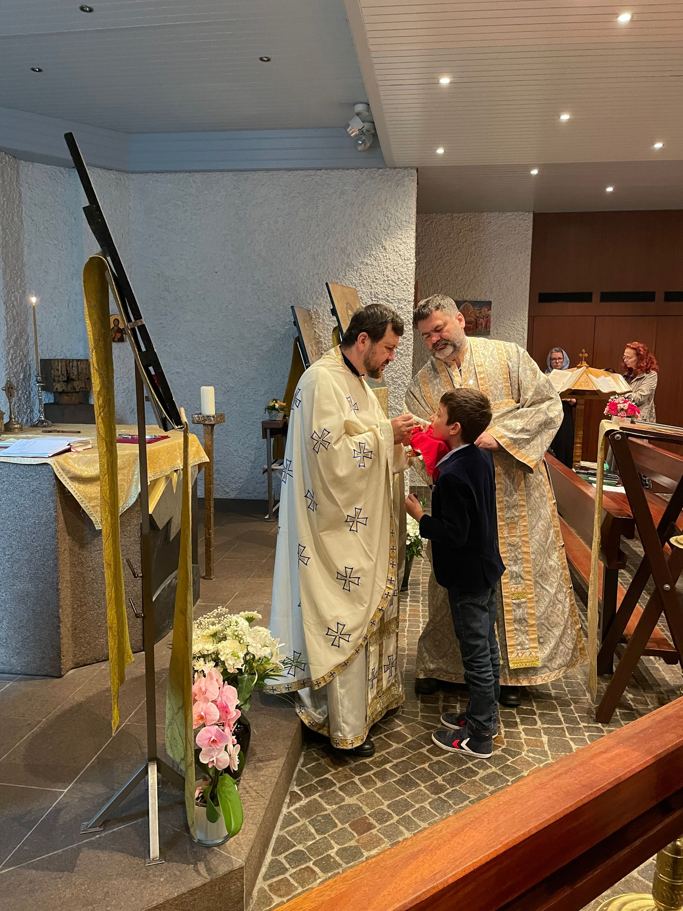

In cadrul Parohiei Ortodoxe Sfantul Nicolae Zurich credinciosii pot beneficia de servicii religioase specifice credintei crestin ortodoxe. Pentru detalii va rugam sa va adresati direct preotului paroh.

**Platile pentru serviciile liturgice se fac in contul**:  
**IBAN**:  
CH85 0483 5035 8248 3100 0;  
**SWIFT/BIC**:  
CRESCHZZ80H  
**Rumaenisch-Orthodoxe Kirchgemeinde St. Nikolaus, Wehntalerstr. 451**  
**8046 Zuerich, Konto: 80-500-4, Credit Suisse, 8070 Zürich**

† Taina Botezului † Taina Mirungerii † Taina Spovedaniei (marturisirea) † Taina Impartasaniei (cuminecarea) † Taina Cununiei (nunta) † Taina Sfantului Maslu † Inmormantare † Parastas † Sfestania (sfintirea casei) † Alte slujbe si rugaciuni

Cine poate boteza?

Dreptul de a savarsi Botezul il are numai episcopul sau preotul (Can. 46-50, ale Sf. Apostoli). In lipsa de preot poate boteza si calugarul simplu sau diaconul, iar la vreme de mare nevoie, daca pruncul e pe moarte, il poate boteza orice crestin, barbat sau femeie si chiar tatal pruncului. Cum? - Afundand pruncul de trei ori in apa curata si rostind formula sfanta a Botezului: «Boteaza-se robul (roaba) lui Dumnezeu (numele) in numele Tatalui si al Fiului si al Sfantului Duh, Amin»505 (Can. 44-45 al Sf. Nichifor Marturisitorul si Marturisirea Ortodoxa, partea I, Raspuns la intreb. 103, trad. cit. p. 93). Dar daca cel botezat astfel ramane in viata, preotul va completa slujba Botezului, dupa randuiala obisnuita, dar numai de la cufundare inainte, adica nu se mai citesc exorcismele si nu se mai face Sfintirea apei, ci numai il miruieste cu Sf. Mir, citindu-i rugaciunile care urmeaza de aici inainte (Ghenadie, fost Episcop de Arges, Liturgica, Buc. 1877, p. 182; Pr. Prof. Dr. Ene Braniste, Liturgica speciala, Ed. Inst. Biblic, Bucuresti, 1980, p. 356).

Unde se savarseste Botezul?

In pridvorul sau pronaosul bisericii. Canoanele opresc savarsirea Botezului nu numai in case, ci chiar in paraclisele din casele particulare (Can. 59, Sinod. VI ecum. si Can. 31 al aceluiasi Sinod). Numai in cazuri cu totul rare si de mare nevoie, frig grozav, pericol de moarte pentru prunc etc., se ingaduie savarsirea Botezului in case.

Cand se savarseste Botezul?

Pentru Botezul pruncilor, nu exista zile sau ceasuri hotarate, pentru ca sa nu se intample sa moara nebotezati. Daca pruncul e firav si exista temere ca nu va trai, el poate fi botezat indata dupa nastere (Con. 38 al Sf. Nichifor Marturisitorul; Simion al Tesalonicului, Despre Sfintele Taine, cap. 61 si 62 (trad. rom, p. 72, 77); Rugaciune la insemnarea pruncului cand i se pune numele a opta zi dupa nastere, in Molitfelnic (editia 1984, p. 13-14)). Daca nu, Botezul se face de obicei la opt zile dupa nasterea pruncului, sau in orice zi de sarbatoare dupa Liturghie.

Ce sunt nasii? Care e rostul lor la Botez si care sunt datoriile lor fata de fini?

Nasii sunt persoanele in varsta care insotesc pe prunc la Botez, raspunzand si facand cuvenita marturisire de credinta in locul si in numele pruncului ce se boteaza. Ei sunt parintii sufletesti ai pruncului, nascandu-l pentru viata cea noua, in Duhul, asa cum parintii l-au nascut pentru viata cea trupeasca. Sunt totodata garanti (sau chezasi) ai acestuia in fata lui Dumnezeu si a Bisericii, chezasuind ca pruncul (finul) va fi crescut in credinta crestina si ca va fi un bun credincios509 (Dionisie Pseudo-Areopagitul, Despre ierarhia bisericeasca, VII, 3, trad. rom. de Pr. C. Iordachescu, 1932, p. 150-152 si Simion al Tesalonicului, Despre Sfintele Taine, cap. 62, trad. rom. p. 76). Nasul trebuie sa fie crestin ortodox (Sf. Simion al Tesalonicului, Despre Sfintele Taine, cap. 62, trad. rom. p.73 si Randuiala inaintea Sf. Botez, in "Molitfelnic", ed. 1937, p. 14) si bun credincios, in varsta si de acelasi sex cu pruncul ce se boteaza. Nu pot fi nasi parintii copilului. Este bine ca pentru fiecare nou botezat sa fie numai un nas. Nasul este dator sa se ingrijeasca de viata religioasa si morala a finului sau si la vremea cuvenita sa-l invete adevarurile credintei crestine. Sa-i fie invatator si indrumator in cele sufletesti, sarguindu-se a face din el un bun credincios si vrednic madular al Bisericii in care a intrat prin Botez. La randul sau, finul este dator sa asculte pe nas si sa-l respecte, la fel ca pe parintii sai dupa trup.

Inainte de slujba Botezului ce randuiala se indeplineste pentru cel ce vine sa se boteze?

Se indeplineste mai intai Randuiala la facerea catehumenului, adica se face pregatirea celui ce are sa fie botezat. Aceasta randuiala se face in fata usilor bisericii, in pridvor, deoarece cel nebotezat, nefiind inca spalat de pacatul stramosesc, nu e madular al Bisericii si nici cetatean al cerului ale carui usi ni le deschide numai Botezul (Simion al Tesalonicului, Despre tarnosirea bisericii, cap. 155, trad. rom. p. 129).

Care sunt partile principale ale slujbei facerii catehumenului?

Sunt: exorcismele, lepadarile si impreunarea cu Hristos.

Ce sunt exorcismele?

Sunt trei rugaciuni in care preotul roaga pe Dumnezeu sa indeparteze de la catehumen toata puterea cea rea a diavolului.

Dar lepadarile si impreunarea cu Hristos ce sunt?

Sunt intreita lepadare a catehumenului sau a nasului, in numele catehumenului, de satana, urmata de intreita lui asigurare ca s-a unit cu Hristos. In timpul lepadarilor, catehumenul e intors cu fata spre Apus sufland si scuipand intr-acolo de trei ori, deoarece Apusul e nu numai locul de unde vine intunericul, ci si locasul celui rau, al lui satana, care e numit si "stapanitorul intunericului" (Luca 22, 32; Efes. 6, 6, 12; Col. 1, 13). Urmand deci cuvintelor Sfantului Apostol Pavel, care ne indeamna "sa lepadam dar lucrurile intunericului si sa ne imbracam cu armele luminii" (Rom. 13, 12), catehumenul scuipa pe diavol, in semn ca s-a lepadat cu totul de el si de faptele lui, adica de pacate. Si, dimpotriva, atunci cand catehumenul (nasul) marturiseste unirea sa cu Hristos, o face cu fata spre Rasarit, caci intr-acolo era zidit Raiul (Fac. 2,8), din care au fost izgoniti primii oameni in urma pacatului si pe care ni-l deschide iarasi Botezul si tot de acolo ne rasare nu numai soarele, izvorul luminii, ci ne-a si venit Lumina cea adevarata a sufletelor, Hristos, Care este numit adesea "Soarele dreptatii" sau "Rasaritul cel de sus" (Luca 1, 78, comp. si Zah. 3, 3, 8; 6, 12 si Mal. 4, 2. Vezi si troparul Craciunului)512 (Sf. Chiril al Ierusalimului, Cateheza 1 mistagogiga, 4-9 (trad. rom. cit., p. 543-547); Sf. Simion al Tesalonicului, Despre Sfintete Taine, cap. 62 (trad. rom. p.74); N. Cabasila, Despre viata in Hristos, cart. II, trad. rom. de Pr. T. Bodogae, Sibiu, 1946, p. 31 s.u.). Unirea cu Hristos se face prin credinta, iar dovada se face prin marturisirea credintei crestine, adica prin rostirea Crezului. (Cand cel ce se boteaza e prunc, Crezul trebuie sa-l spuna nasul, in numele pruncului, iar nu altcineva).

Cum trebuie intelese exorcismele si lepadarile de la Botez?

Exorcismele si lepadarile nu inseamna ca Biserica socoteste pe cei ce vin la Botez ca stapaniti cu adevarat de diavol, cum sunt demoniacii, indracitii sau cei munciti de duhuri necurate, ele vor sa spuna numai ca cel ce nu-L are inca pe Hristos se afla in robia pacatului, si deci in puterea diavolului, care stapaneste pe cei in pacat, sau in afara harului (Efes. 2, 2). Din aceasta robie il elibereaza Biserica pe catehumen prin exorcisme si lepadari, trecandu-l sub puterea lui Hristos, Stapanul nostru cel adevarat si bun.

Care e prima parte de seama a slujbei Botezului?

Este sfintirea apei pentru botez, printr-o ectenie si o lunga si frumoasa molitva, in care preotul se roaga pentru sine insusi, ca Dumnezeu sa-i ajute sa savarseasca cu vrednicie Sfanta Taina, pentru cel ce se boteaza si pentru sfintirea apei prin harul si puterea Sfantului Duh.

Care e a doua parte de seama a slujbei Botezului si ce simbolizeaza ea?

Este ungerea celui ce se boteaza cu untdelemnul bucuriei (Ps. 44, 9 si Evr. 1, 9) pe frunte, piept, la maini si la picioare. Acest untdelemn este binecuvantat atunci de catre preot, printr-o rugaciune deosebita, si din el preotul toarna in apa botezului, de trei ori, crucis. Ungerea inseamna mai multe lucruri: a) Intai, ca untdelemnul fiind rodul maslinului, ungerea cu el este semnul milei si al bunatatii dumnezeiesti, prin care catehumenul a fost izbavit din noianul pacatelor, asa cum ramura de maslin, adusa de porumbel lui Noe, era semnul impacarii maniei dumnezeiesti si al izbavirii din potop (Fac. 8, 11). Caci apa potopului a fost preinchipuirea Botezului, precum ne invata Sf. Apostol Petru (I Petru 3, 20-21), iar porumbelul preinchipuia pe Duhul Sfant513 (Simion al Tesalonicului, Despre Sfintele Taine, cap. 62, trad. rom. p. 77). b) Al doilea, ne aduce aminte de ungerea cu care erau unsi in Legea veche arhiereii, imparatii si proorocii, cu care a fost uns insusi Mantuitorul, "Unsul Domnului"(IRegi 10,1, 5;Isaia61, l;Luca4,18;Fapte 10,10, 38) si la care ne-a facut si pe noi partasi, caci insusi numele de "crestin" vine de la cuvantul grecesc Hristou, care inseamna "uns" (A se vedea rugaciunea respectiva (pentru binecuvantarea untdelemnului) din Molitfelnic ed. 1984, p. 35; N. Cabasila, Despre viata in Hristos, cart. II, trad. rom. p. 34). c) Al treilea, ungerea inchipuie aromatele cu care a fost uns trupul Domnului, inainte de ingropare, deoarece catehumenul va inchipui, prin afundarea in apa, ingroparea impreuna cu Hristos si invierea impreuna cu El.

Care este a treia parte de seama a slujbei Botezului si ce inchipuie ea?

A treia si cea mai de seama parte a slujbei Botezului este insasi savarsirea Tainei, adica intreita afundare a pruncului de catre preot in apa sfintita din cristelnita, cu cuvintele: «Boteaza-se robul (roaba) lui Dumnezeu (N), in numele Tatalui (la intaia afundare) si al Fiului (la a doua afundare) si al Sfantului Duh, acum si pururea si in vecii vecilor. Amin» (la a treia afundare). Aceasta intreita afundare arata pe de o parte ca temeiul credintei noastre e Sfanta Treime, iar pe de alta inchipuie cele trei zile petrecute de Domnul in mormant (Matei 12, 40); prin afundarea in apa se inchipuie moartea noastra pentru viata in pacat, de pana aici, si ingroparea noastra impreuna cu Hristos; iar prin iesirea din apa se inchipuie invierea noastra impreuna cu El, pentru viata cea noua intru Hristos (Asezamintele Sf. Apostoli, cart. III, cap. 17 (trad. rom. cit., p. 100); Sf. Chiril al Ierusalimului, Cateheza III, 12 si Cateheza II Mystag., trad. rom. cit., p. 98, 551-554; Dionisie Pseudo-Areopagitul, op. si trad. rom. cit., cap. II, 3, p. 86; Sf. Ioan Darnaschin, Dogmatica, art. IV, cap. 9, trad. cit., p. 248; Sf. Gherman al Constantinopolului, op. si trad. rom. cat., p. 4-5; N. Cabasila, Despre viata in Hristos, cart. II, trad. rom. cit., p. 26, 37 si u.); Simion al Tesalonicului, Despre Sfintele Taine, cap. 62-64, trad. rom. p. 77, 79-80). Prin Botez, spalandu-ni-se pacatele, ne facem astfel partasi mortii si invierii lui Hristos, intram intr-o viata noua, suntem morti pentru pacat si viem pentru Dumnezeu (Rom. 6, 3-11). Cristelnita si apa botezului este pentru noi mormant si maica duhovniceasca, nascandu-ne pentru Hristos si tinand deci locul pantecelui celui curat al Fecioarei din care S-a nascut Acesta (Sf. Simion al Tesalonicului, loc. cit).

Cand se savarseste a doua Taina, adica Ungerea cu Sfantul Mir?

In Biserica Ortodoxa aceasta Sfanta Taina se impartaseste crestinului indata dupa Botez; de aceea, randuiala ei nu alcatuieste o slujba aparte, de sine statatoare, ci e impreunata cu aceea a Botezului, ca o prelungire a ei.

Ce este Sfantul Mir?

Este untdelemnul amestecat cu mirodenii, pregatit (fiert) dupa o randuiala anumita in fiecare an, in primele trei zile din saptamana Patimilor si sfintit de catre Patriarhul Tarii, joi in aceeasi saptamana, la Liturghie. Se imparte episcopilor si tuturor bisericilor. Prin multimea mirodeniilor din care e facut, el inchipuie multimea si felurimea darurilor si puterilor Sfantului Duh (Ibidem, cap. 65, 71, trad. rom. p. 80 si 84). Sfantul Mir e folosit nu numai la a doua Taina, dupa Botez, ci si la sfintirea antimiselor si a bisericilor.

