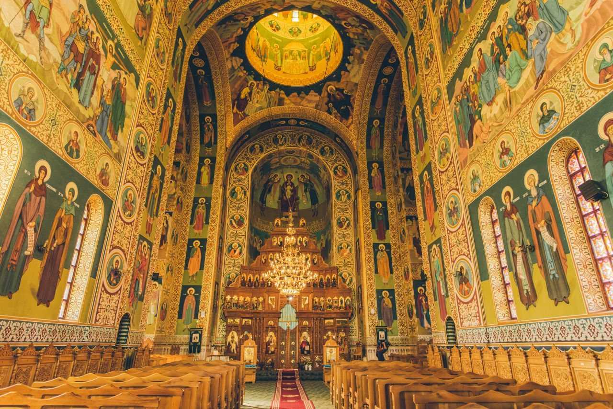

## STUDIU

## O explicare a Sfintei Liturghii

Poate că fiecare om se roagă zilnic la el acasă. Dar, între rugăciunea de acasă și rugăciunea de la biserică sau, mai bine zis, între rugăciunea de acasă și slujba de la biserică este o mare deosebire, o deosebire pe care nici eu n-am învățat-o de mult.

[Citeste mai mult](https://www.bor-zh.ch/files/SfLiturgie.pdf) 

## STUDIU

## Das Bekenntnis des Glaubens der Heiligen Orthodoxen Kirche

Ich glaube an den einen Gott, den Vater, den Allmächtigen, den Schöpfer des Himmels und der Erde, aller sichtbaren und unsichtbaren Dinge. Und an den einen Herrn, Jesus Christus, Gottes eingeborenen Sohn, den aus dem Vater Geborenen vor aller Zeit. Licht vom Lichte, wahrer Gott vom wahren Gott, gezeugt, nicht geschaffen, eines Wesens mit dem Vater; durch ihn ist alles geschaffen.

[Citeste mai mult](https://www.bor-zh.ch/files/Das%20Bekenntnis%20des%20Glaubens%20der%20Heiligen%20Orthodoxen%20Kirche.pdf) 

## STUDIU

## Über die Taufe

Hl. Johannes der Goldmund ist der berühmteste Prediger der alten Kirche, und das mit Recht. Er ist der einzige Prediger dieser Zeit, der durch seine lebendige, zu Herzen gehende Sprache auch den heutigen Menschen noch unmittelbar anzureden vermag. Er ist in Antiochien 344 oder kurz danach geboren. Unter seinen Lehrern findet sich der berühmte Rhetor Libanius

[Citeste mai mult](https://www.bor-zh.ch/wp-content/uploads/2024/05/Ueber_die_Taufe.doc) 

## STUDIU

## Über die Heilige Eucharistie

Er wurde zwischen 1319 und 1323 in Thessalonike geboren, aus vornehmer Familie. Neilos Kabasilas, Erzbischof von Thessalonike, war sein Onkel. Nach Studien in Konstantinopel (ca. 1337-1343) kehrte er in seine Heimatstadt zurück.

[Citeste mai mult](https://www.bor-zh.ch/wp-content/uploads/2024/05/Ueber_die_Heilige_Eucharistie.doc) 

## STUDIU

## Über das Gebet Vater unser

Ambrosius, Bischof von Mailand 374-397, ist wahrscheinlich 339 in Trier geboren. Er entstammte einer der ersten römischen Familien. Sein bald nach seiner Geburt verstorbener Vater war zuletzt praefectus praetorio – das heisst Regierungschef – für Gallien.

[Citeste mai mult](https://www.bor-zh.ch/wp-content/uploads/2024/05/Ueber_das_Gebet_Vater_unser.doc) 

## STUDIU

## Mihai Eminescu - poet național

La 15 ianuarie 2005 se implinesc 155 de ani de la nasterea marelui poet Mihai Eminescu. Era al saptelea copil, din cei unsprezece ai familiei Eminovici. Din clasa a III-a primara urmeaza scoala la Cernauti, unde il are ca profesor si pe Aron Pumnul, un mare patriot, pe care Eminescu l-a admirat in mod deosebit.

[Citeste mai mult](https://www.bor-zh.ch/wp-content/uploads/2024/05/eminescu.doc) 

## STUDIU

## Unirea Principatelor Române Moldova și Tara Românească

Unirea Principatelor Moldova si Tara Romaneasca, numita si Unirea cea mica, a avut loc la data de 24 ianuarie 1859. La acest eveniment insemnat din istoria poporului roman, Biserica a avut o contributie fundamentala.

[Citeste mai mult](https://www.bor-zh.ch/wp-content/uploads/2024/05/unirea.doc) 

## STUDIU

## Despre secularizare

Unirea Principatelor Moldova si Tara Romaneasca, numita si Unirea cea mica, a avut loc la data de 24 ianuarie 1859. La acest eveniment insemnat din istoria poporului roman, Biserica a avut o contributie fundamentala.

[Citeste mai mult](https://www.bor-zh.ch/wp-content/uploads/2024/05/secularizare.doc) 

## STUDIU

## Coruptibilitate și incoruptibilitate în viața umană

Potrivit dictionarelor contemporane de teologie, coruptibil înseamna supus coruperii sau stricaciunii, adica schimbarii care se sfârseste prin distrugerea substantei. Orice degradare este însotita de o generare si orice generare, în cazul fiintelor materiale, presupune o degradare.

[Citeste mai mult](https://www.bor-zh.ch/wp-content/uploads/2024/05/coruptibilitate.doc) 

## STUDIU

## Sinodul de la Iași, coresponsabilitate pastorală și cooperare interetnică

Scopul principal al convocarii Sinodului si al lucrarilor lui a fost necesitatea unui raspuns teologic-pastoral clar, concis si util pentru clerul si credinciosii ortodocsi, tulburati de controversele legate de Marturisirea de credinta atribuita Patriarhului Ecumenic Chiril Lukaris si publicata în 1629 la Geneva, în latina si în 1633 în greaca, marturisire care se abatea grav de la credinta ortodoxa.

[Citeste mai mult](https://www.bor-zh.ch/wp-content/uploads/2024/05/Sinodul-Iasi.doc) 
